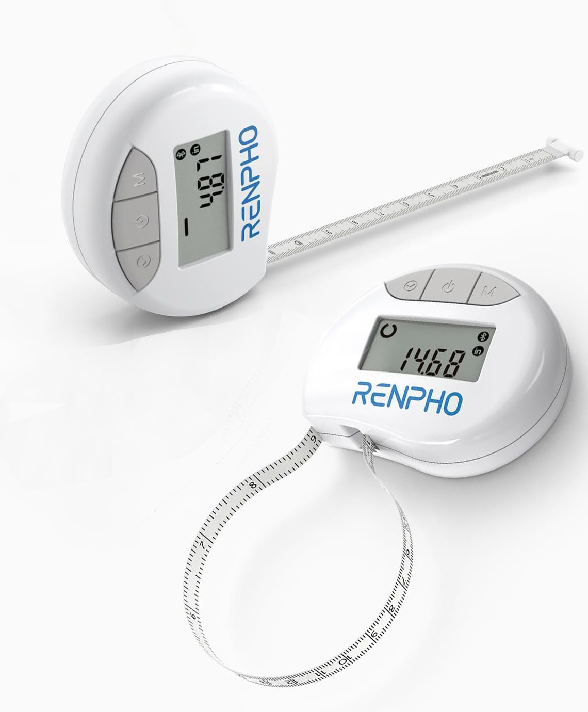
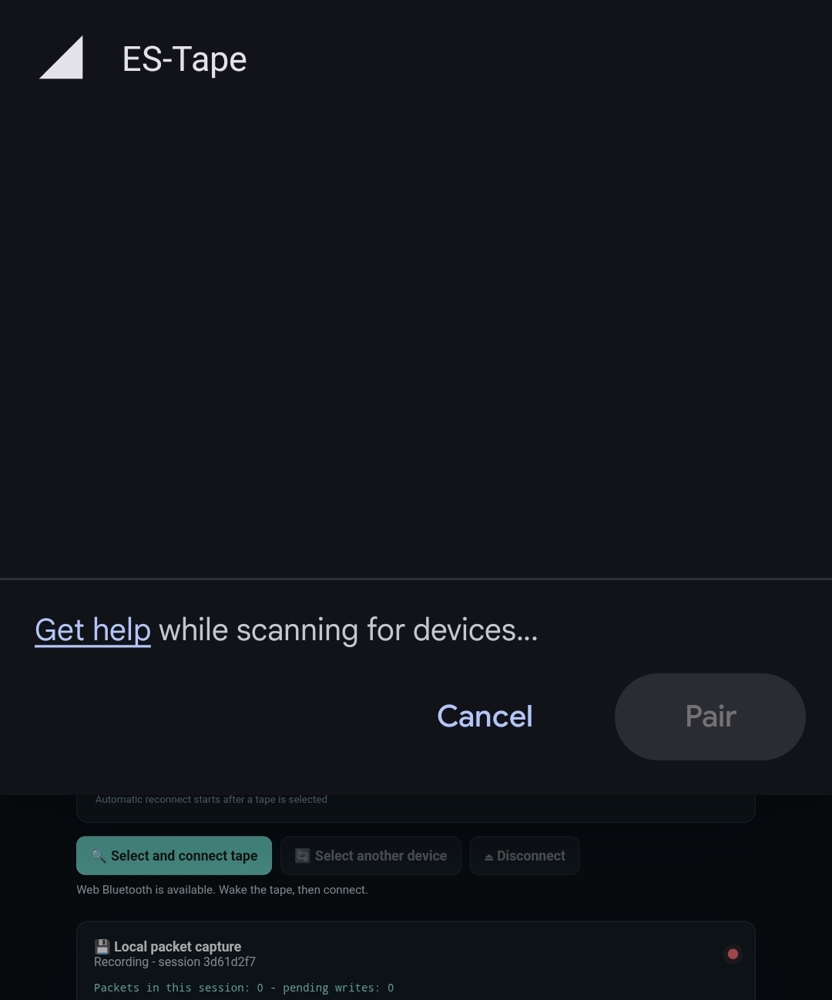
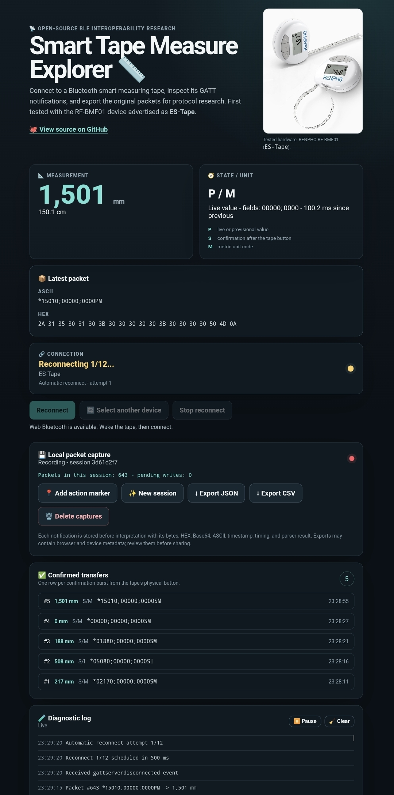

# 📏 Smart Tape Measure Web Bluetooth

Turn a **smart Bluetooth tape measure** into an open data source. This
dependency-free Web Bluetooth and Bluetooth Low Energy (BLE) explorer connects
to digital measuring tapes, reads GATT notifications, decodes measurements,
separates live and confirmed packets, and exports raw evidence for protocol
reverse engineering.

The first hardware target is a **RENPHO RF-BMF01** advertising as `ES-Tape`.
One physical unit has been tested so far; other smart body measuring tapes may
work after their service UUIDs and packet formats are mapped. Hardware rarely
introduces itself properly, so this repository handles the awkward hello. 👋📡



> 📸 The photo shows the physical RENPHO RF-BMF01 unit used for the first
> protocol tests.

> [!IMPORTANT]
> This is an experimental, unofficial interoperability project. It is not a
> medical device and must not be used for diagnosis, treatment, or
> safety-critical measurements.

## 🧰 Hardware coverage

| Device | Advertised name | Status |
| --- | --- | --- |
| RENPHO RF-BMF01 | `ES-Tape` | Tested on one physical unit |
| Other BLE smart tape measures | Varies | Not tested yet; reports welcome |

The model-specific adapter is intentionally small. The broader project is about
repeatable techniques for exploring smart measurement devices over BLE.

## 🖥️ Interface

### 1. Select the Bluetooth device



### 2. Explore live measurements and packets



The interface shows:

- current millimetres and centimetres;
- the original ASCII and HEX notification;
- connection and automatic reconnect state;
- a compact numbered list of confirmed transfers from the tape button;
- local JSON/CSV capture controls;
- a diagnostic log that can be paused without pausing packet capture.

### What do `P`, `S`, and `M` mean?

| Code | Working interpretation |
| --- | --- |
| `P` | Live or provisional measurement while the tape is moving |
| `S` | Confirmation burst observed after the tape's physical send/confirm button |
| `M` | Metric unit code |

These labels are behavioural interpretations, not manufacturer-confirmed field
names. The exact words behind the letters remain unknown.

## 🚀 Quick start

Web Bluetooth requires a
[secure context and explicit user permission](https://developer.mozilla.org/en-US/docs/Web/API/Web_Bluetooth_API).
Choose either a local static web server or GitHub Pages, then open the resulting
URL in a browser that exposes Web Bluetooth. Support is limited, so check the
current
[compatibility table](https://developer.mozilla.org/en-US/docs/Web/API/Bluetooth/requestDevice#browser_compatibility)
before testing.

### Option 1: Run locally

Any static web server works: Python's built-in server, Apache HTTP Server,
Nginx, Caddy, VS Code Live Server, or an equivalent. Use any local port on
`localhost`, or publish that port over HTTPS with
[Cloudflare Tunnel](https://developers.cloudflare.com/cloudflare-one/networks/connectors/cloudflare-tunnel/)
in Cloudflare Zero Trust.

### Option 2: Publish with GitHub Pages

No build workflow is needed. In **Settings -> Pages**, choose
**Deploy from a branch**, select `main`, choose `/(root)`, and save. Open the
resulting HTTPS URL on the device that will connect to the tape.

Live demo: [Smart Tape Measure Explorer](https://akunopaka.github.io/smart-e-tape-measure-web-bluetooth/)

### Connect the tape

1. Turn on Bluetooth.
2. Wake the tape or extend it slightly.
3. Select **Select and connect tape**.
4. Choose `ES-Tape` in the browser dialog.
5. Move the tape and compare the web value with its physical display.
6. Press the tape's confirmation button and check **Confirmed transfers**.

System Bluetooth pairing is not required. The browser chooser must be opened by
a click because Web Bluetooth discovery requires a user gesture.

## 🔬 Verify with nRF Connect first

[nRF Connect for Mobile](https://www.nordicsemi.com/Products/Development-tools/nRF-Connect-for-mobile)
is a useful independent check before blaming the browser. The browser deserves
a fair trial. 🧑‍⚖️

1. Start a BLE scan, wake the tape, and connect to `ES-Tape`.
2. Open service `0783b03e-8535-b5a0-7140-a304d2495cb7`.
3. Enable notifications on characteristic
   `0783b03e-8535-b5a0-7140-a304d2495cb8`.
4. Extend the tape and confirm that 20-byte notifications appear.
5. Press the tape button and look for a burst ending in `SM`.
6. Do not write to `...5cba`; its command protocol is not documented here.

If nRF Connect works but the browser cannot find the tape, check browser
support, site permissions, HTTPS/localhost, and whether the tape is awake.

## 🧭 Reverse engineering: A -> B -> C

### A. 👀 Observe

Scan without assuming what the device should do. Record its advertised name,
services, characteristics, properties, descriptors, and untouched notification
bytes. Start read-only; mysterious write characteristics do not need a greeting.

### B. 🧩 Correlate

Change one physical input at a time: extend the tape, hold a known length,
switch units, or press one button. Add an action marker, record the physical
display, and pair it with the exact packet and timestamp.

### C. ✅ Confirm

Repeat the same test, try boundary values, disconnect and reconnect, and separate
facts into **observed**, **inferred**, and **unknown**. Only then encode the rule
in the parser. A second physical device is the best test of whether a finding is
a protocol rule or merely one unit's personality.

See [docs/protocol.md](docs/protocol.md) for the current evidence and open
questions.

## 📦 Observed protocol

| Role | UUID |
| --- | --- |
| Custom service | `0783b03e-8535-b5a0-7140-a304d2495cb7` |
| Notify characteristic | `0783b03e-8535-b5a0-7140-a304d2495cb8` |
| Write Without Response characteristic | `0783b03e-8535-b5a0-7140-a304d2495cba` |

Observed measurement frame:

```text
*AAAAA;BBBBB;CCCCSU\n
```

Example:

```text
*00530;00000;0000PM\n
```

The current decoder interprets `00530` as `53 mm` (`5.3 cm`). The second and
third numeric fields remain unknown, which is much better than giving them
confidently wrong names.

## 🔐 Capture data and privacy

Captures stay in IndexedDB for the current origin. JSON and CSV exports may
include the page URL, browser user agent, browser-provided device identifier,
timestamps, and raw packets. Review exports before publishing them.

**Delete captures** removes this site's stored sessions and immediately starts a
new empty session. Clearing browser site data removes them as well.

## 🛠️ Development

The app uses plain HTML, CSS, JavaScript, and IndexedDB. There is no framework,
build step, backend, account, analytics, cloud storage, or runtime package to
install. Automated decoder checks are optional developer tooling.

```bash
npm test
```

```text
.
|-- index.html                 User interface
|-- app.js                     Web Bluetooth and capture flow
|-- protocol.js                Packet decoder and BLE UUIDs
|-- storage.js                 IndexedDB storage and exports
|-- styles.css                 Responsive interface
|-- test/                      Decoder checks
|-- docs/protocol.md           Evidence and unknowns
`-- docs/github-publishing.md  Repository description and topics
```

Found another tape that speaks BLE? Excellent. Read
[CONTRIBUTING.md](CONTRIBUTING.md) before sharing a capture. 🧪

## ⚖️ Independent research notice

The protocol notes come from black-box observation of BLE traffic and controlled
physical measurements for interoperability research. This repository contains
no extracted firmware, proprietary application source code, or copied product
artwork.

RENPHO and other names or marks belong to their respective owners. This project
is not affiliated with, sponsored by, or endorsed by the manufacturer. Laws on
reverse engineering differ by jurisdiction; contributors are responsible for
their own compliance.

## 📄 License

[MIT](LICENSE)

Repository: [akunopaka/smart-e-tape-measure-web-bluetooth](https://github.com/akunopaka/smart-e-tape-measure-web-bluetooth)
